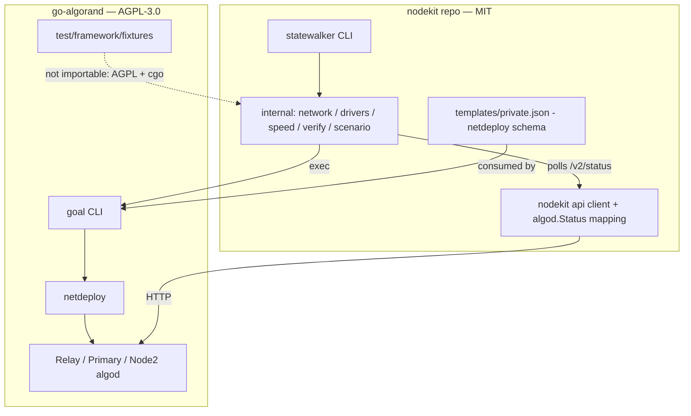

# Overlap with the go-algorand test harness

An evaluation of how much of statewalker duplicates the upstream
[algorand/go-algorand](https://github.com/algorand/go-algorand) test harness,
and what (if anything) should be pulled from upstream instead.

- **Pinned upstream baseline**: `v5.0.1-stable` (the same tag nodekit's algod
  API codegen was reviewed against, see
  [`reviews/pr-192-track-spec.md`](../reviews/pr-192-track-spec.md)). All
  upstream file references below were verified at that tag.
- **Date**: 2026-09-14.
- **Method**: every file under `tools/statewalker/internal/` and
  `tools/statewalker/cmd/` (plus `templates/` and `journey/`) was matched
  against the upstream harness surfaces: `netdeploy/`,
  `test/framework/fixtures/`, `test/testdata/nettemplates/`,
  `test/e2e-go/features/` and `test/scripts/e2e_subs/`.

**TL;DR**: there is real overlap, but almost none of it is *duplication of
code*. Statewalker already consumes the upstream harness at its process
boundary — `goal network` **is** upstream `netdeploy`, and
`templates/private.json` **is** an upstream `NetworkTemplate`. The pieces that
look duplicated (consensus speed-up, catchup walking, upgrade voting)
re-implement upstream *patterns* because the upstream *code* is not importable
(AGPL-3.0 license, cgo/libsodium build, `testing.TB` coupling). Recommendation:
**keep the process boundary**; align values and conventions, never code.

## Architecture: statewalker already sits on top of upstream

`goal network create|start|stop|delete` is a thin CLI front-end over upstream
`netdeploy.Network` (`netdeploy/network.go`). Every network statewalker
provisions is therefore built, wired and managed by upstream harness code —
just across a process boundary instead of a Go import.

## Component mapping

Verdict legend: **reused via CLI** (upstream code already does the work, we
drive it through `goal`/data files) · **pattern duplication** (we re-implement
an upstream approach; code reuse blocked, values/conventions could align) ·
**intentionally different** (divergence is the point) · **no counterpart**.

### `internal/`

| statewalker | upstream counterpart (`v5.0.1-stable`) | verdict |
|---|---|---|
| `internal/network.go` — `CreatePrivate`/`StartPrivate`/… wrap `goal network` | `netdeploy/network.go` (`CreateNetworkFromTemplate`, `Network.Start/Stop/Delete`), `netdeploy/networkTemplate.go` | **reused via CLI** — `goal network -r/-t` is exactly `netdeploy`; zero duplication |
| `internal/network.go` — `MergeNodeConfig` (per-node `config.json` overrides) | `netdeploy.TemplateOverride` / `OverrideConsensusVersion` and the `consensus` parameter of `CreateNetworkFromTemplate` (`netdeploy/network.go`) | **pattern duplication** — upstream merges overrides in Go before writing node dirs; we merge JSON after `goal network create`. Same file format (`config.json`), ~20 lines, not worth more |
| `internal/network.go` — localnet mode + `WriteLocalnetShim` | none (algokit is a separate AlgoKit project; upstream `docker/` images are unrelated) | **no counterpart** |
| `internal/drivers.go` — wraps `goal account/clerk/node/protocols`, `WipeLedger`, `WriteConsensus` | `libgoal.Client` and fixture helpers (`test/framework/fixtures/restClientFixture.go`: `SendMoneyAndWait`, `WaitForTxnConfirmation`, …) | **reused via CLI** — every driver is a `goal` subcommand invocation; upstream reaches the same node APIs through `libgoal` in-process. `WipeLedger` has no upstream helper (upstream tests recreate networks instead) |
| `internal/speed.go` — clone genesis proto, shorten `AgreementFilterTimeout{,Period0}`, install `consensus.json` | `test/framework/fixtures/libgoalFixture.go:67` `(f *RestClientFixture) SetConsensus(...)` + `test/e2e-go/features/catchup/catchpointCatchup_test.go:113` `applyCatchpointConsensusChanges` (sets `AgreementFilterTimeoutPeriod0 = 1s`, `AgreementFilterTimeout = 1s`) | **pattern duplication** — same technique (deploy a consensus override before start), same knobs. Upstream mutates `config.ConsensusParams` in Go; we merge raw JSON from `goal protocols` because `config` is unimportable. Values differ slightly: upstream uses 1s/1s, statewalker 1s/2s (deliberately roomier recovery periods). See backlog |
| `internal/verify.go` — `WaitFor`, `WaitForRoundsToAdvance`, `ExpectedState` against `/v2/status` | `RestClientFixture.WaitForRound` / `WaitForRoundWithTimeout` (`restClientFixture.go`) | **intentionally different** — upstream asserts through `libgoal`/REST client types; statewalker asserts through nodekit's generated `api` client and `internal/algod.Status` mapping, so a passing scenario proves *what the TUI renders*. Replacing this with upstream code would delete statewalker's reason to exist |
| `internal/rounds.go` — `MeasureRoundTime` from block timestamps, `DurationToRounds` | none — upstream tests know their consensus params in-process, so they compute rounds directly (e.g. `10*catchpointCatchupProtocol.AgreementFilterTimeout` in `catchpointCatchup_test.go:702`) | **no counterpart** — measuring round time empirically is only needed because we sit outside the process and reuse nodekit's block-metrics code |
| `internal/scenario.go` — `Scenario`/`Phase` runner with keep/teardown | `test/e2e-go/features/*` tests structured around `testing.T` + `fixtures.Setup(t, template)` / deferred `Shutdown()` | **no counterpart (reusable)** — the fixture lifecycle is welded to `testing.TB`/`require` (`libgoalFixture.go` imports `testing`, `Setup(t TestingTB, ...)`); a standalone CLI cannot reuse it |
| `internal/journey.go` — docker/systemd container helpers, `WriteNodeShim` | upstream `docker/` builds algod release images (no systemd, no apt-install journey); `test/e2e-go` never containerizes nodes | **no counterpart** — the journey exists to test nodekit's end-user install/upgrade path (apt package + `nodekit upgrade`), out of scope upstream |
| `internal/{scenario,speed,verify}_test.go` | upstream unit tests of its own harness (`netdeploy/networkTemplates_test.go` etc.) | n/a — unit tests of our harness code |

### `cmd/` and assets

| statewalker | upstream counterpart (`v5.0.1-stable`) | verdict |
|---|---|---|
| `cmd/root.go`, `cmd/helpers.go`, `main.go` | none (upstream harness has no standalone CLI; `test/scripts/e2e_subs/` is driven by `e2e_client_runner.py`) | **no counterpart** — cobra plumbing |
| `cmd/network.go` — `network up/down/status`, speed + catchpoint config | `netdeploy` via `goal network`; relay archival/catchpoint settings mirror `test/testdata/nettemplates/CatchpointCatchupTestNetwork.json` and `cfg.CatchpointInterval` in `catchpointCatchup_test.go` | **reused via CLI** (provisioning) + **pattern duplication** (catchpoint node-config values; upstream uses interval 4 for test speed, we use 100 to exercise the realistic `CatchpointLookback` path) |
| `cmd/partkeys.go` — seed/online/offline/zombie/list | `test/e2e-go/features/participation/` (e.g. `participationExpiration_test.go`, `onlineOfflineParticipation_test.go`), `test/testdata/nettemplates/ShortParticipationKeys.json` | **pattern duplication** — same scenarios (short-validity keys, on/offline keyreg), driven via `goal account addpartkey/changeonlinestatus` instead of `libgoal`. The zombie case (IS #41) and wall-clock `--expiring` conversion are statewalker-specific |
| `cmd/traffic.go` — background self-payment loop | `RestClientFixture.SendMoneyAndWait` (`restClientFixture.go`); `test/scripts/e2e_client_runner.py` keeps localnet-like nets moving similarly | **pattern duplication** — trivial loop over `goal clerk send`; nothing importable |
| `cmd/walk.go` — syncing / fast-catchup walks (stop, wipe, restart, `goal node catchup`) | `test/e2e-go/features/catchup/` (`basicCatchup_test.go`, `catchpointCatchup_test.go` — `TestBasicCatchpointCatchup`, `TestCatchpointLabelGeneration`) | **pattern duplication** — upstream walks the same node states to test *algod*; statewalker walks them to test *nodekit's rendering*, so the assertions differ by design (see `internal/verify.go` row) |
| `cmd/upgrade.go` — synthetic `consensus.json` successor + `ApprovedUpgrades` voting | `test/e2e-go/features/` upgrade tests + `test/testdata/nettemplates/TwoNodes50EachV*Upgrade.json` (upgrades bootstrapped from old-protocol genesis); `SetConsensus` deployment path | **pattern duplication** — upstream pins old protocol versions in genesis and upgrades to real successors; statewalker clones the current genesis proto into a synthetic successor so it works against whatever algod release is on `PATH`. Same `consensus.json` mechanism |
| `cmd/stage.go` — named demo/e2e/journey scenario compositions | `test/e2e-go` test functions compose fixtures per test | **no counterpart (reusable)** — composition layer over our own scenario runner |
| `cmd/journey.go`, `journey/Dockerfile` — systemd container, apt install, real `nodekit upgrade` | upstream `docker/` (algod images), `installer/` (deb/rpm packaging) | **no counterpart** — consumes upstream's *published artifacts* (apt package), not its harness |
| `templates/private.json` | `test/testdata/nettemplates/*.json` — identical `netdeploy` schema; closest relatives: `ThreeNodesEvenDist.json` (Relay+2 nodes), `TwoNodesPartlyOffline.json` (offline stake wallet), `CatchpointCatchupTestNetwork.json` (relay for catchup) | **reused (format)** — the template *is* an upstream `NetworkTemplate`; only the stake split (20/70/10 with a 70% anchor) is ours. Upstream's catalog is a ready reference for future scenario networks |

## Why code-level reuse is blocked

1. **License wall.** go-algorand is AGPL-3.0 with additional terms
   (`COPYING` at `v5.0.1-stable`); nodekit is MIT (`LICENSE`). Importing
   `netdeploy`/`libgoal`/`fixtures` — or copying their code — would pull AGPL
   obligations into an MIT module. Not acceptable, even for a non-shipping
   test tool living in the same repo/module.
2. **Build weight.** `netdeploy/networkTemplate.go` imports
   `github.com/algorand/go-algorand/crypto` (cgo + libsodium) and
   `netdeploy/network.go` imports `config`, `gen`, `libgoal`, `nodecontrol`.
   Any import of the harness forces every nodekit contributor and CI job to
   build libsodium.
3. **Test-framework coupling.** The fixtures are not a library:
   `libgoalFixture.go` imports `testing`, `Setup` takes `TestingTB`, failures
   go through `require`. They only work inside `go test`, while statewalker is
   deliberately a standalone CLI usable by developers, CI and tape capture.

What the process boundary buys instead: upstream's provisioning code runs
*unmodified* (via `goal network`), upstream's data formats are consumed as-is
(nettemplates JSON, `consensus.json`, `config.json`), and statewalker stays
MIT, cgo-free and `go build ./...`-clean.

## Recommendation

**Keep the process boundary (status quo).** Statewalker should continue to:

- provision through `goal network` / `algokit localnet` (never import
  `netdeploy`);
- speak upstream's file formats (`NetworkTemplate` JSON, `consensus.json`,
  node `config.json`) rather than its Go types;
- copy *patterns and values* from the upstream harness with a citation, never
  code;
- keep asserting through nodekit's own `api` client + `algod.Status` mapping —
  that divergence from `RestClientFixture` is the product being tested.

## Follow-up backlog (optional, not planned)

- **Speed profile values**: consider matching upstream's
  `applyCatchpointConsensusChanges` (1s/1s filter timeouts) or documenting why
  the roomier 2s `AgreementFilterTimeout` is kept
  (`internal/speed.go` vs `catchpointCatchup_test.go:113`).
- **Template conventions**: when adding scenario networks, start from the
  closest `test/testdata/nettemplates/` entry (e.g. `ShortParticipationKeys.json`
  for expiry scenarios) to stay recognizable to upstream-fluent reviewers.
- **Schema drift watch**: `NetworkTemplate` and `consensus.json` are consumed
  as opaque formats; re-verify against the pinned tag's successors when
  bumping the `goal` version used in CI (last verified: `v5.0.1-stable`).
- **Catchpoint knobs**: upstream test configs (`CatchpointInterval` 4) show how
  far the interval can be squeezed if the ~420-round wait for the first
  catchpoint ever becomes a CI bottleneck (at the cost of realism).
